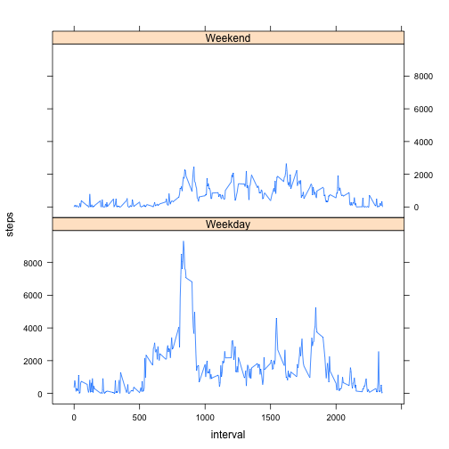

# REPRODUCIBLE RESEARCH PEER ASSESSMENT 1
# =======================================

**Loading and preprocessing the data

Process/transform the data (if necessary) into a format suitable for your analysis.


```r
activity <- read.csv("activity.csv", header=T, sep=",", colClasses=c("date"="Date"))
```

##What is mean total number of steps taken per day? 

Ignore the missing values in the dataset.

Make a histogram of the total number of steps taken each day.

Calculate and report the mean and median total number of steps taken per day.


```r
mydata <- aggregate(steps ~ date, data=activity, sum)
hist(mydata$steps, main="Histogram of Steps taken per Day", xlab="Number of Steps per Day", breaks=12)
```

 

```r
meanA <- format(mean(mydata$steps), scientific=F)

medianA <- median(mydata$steps)
```

**The mean is 10766.19 and the median is 10765.


##What is the average daily activity pattern?

Make a time series plot (i.e. type = "l") of the 5-minute interval (x-axis) and the average number of steps taken, averaged across all days (y-axis)

Which 5-minute interval, on average across all the days in the dataset, contains the maximum number of steps?


```r
mydata2 <- aggregate(steps ~ interval, data=activity, sum, na.rm=T)
plot(mydata2$interval, mydata2$steps, type="l", xlab="5-minute interval", ylab="Number of Steps Taken", main="Average Number of Steps Taken")
```

 

```r
mydata3 <- mydata2[which.max(mydata2$steps),]
```

**The 835 5-minute interval, on average across all the days in the dataset, contains the maximum number of steps.


##Imputing missing values

Note that there are a number of days/intervals where there are missing values (coded as NA). The presence of missing days may introduce bias into some calculations or summaries of the data.

Calculate and report the total number of missing values in the dataset (i.e. the total number of rows with NAs)

Devise a strategy for filling in all of the missing values in the dataset. The strategy does not need to be sophisticated. For example, you could use the mean/median for that day, or the mean for that 5-minute interval, etc.

Create a new dataset that is equal to the original dataset but with the missing data filled in.

Make a histogram of the total number of steps taken each day and Calculate and report the mean and median total number of steps taken per day. Do these values differ from the estimates from the first part of the assignment? What is the impact of imputing missing data on the estimates of the total daily number of steps?


```r
No.NAs <- sum(is.na(activity)) ### count number of NAs
```

**The number of variable reporting NA as a value in the variable 'steps' is 2304.


```r
library("Hmisc")
activity1 <- activity
activity1$steps <- impute(activity1$steps, fun="random")

mydata4 <- aggregate(steps ~ date, data=activity1, sum)
hist(mydata4$steps, main="Histogram of Steps taken per Day", xlab="Number of Steps per Day", breaks=12)
```

 


```r
meanB <- format(mean(mydata4$steps), scientific=F)

medianB <- median(mydata4$steps)
```

The mean number of step taken with new dataset is 10737.52 which is different from the mean 10766.19 of the original dataset.

The median number of step taken with new dataset is 10810 which is different from the mean 10765 of the original dataset.


##Are there differences in activity patterns between weekdays and weekends?

For this part the weekdays() function may be of some help here. Use the dataset with the filled-in missing values for this part.

Create a new factor variable in the dataset with two levels – “weekday” and “weekend” indicating whether a given date is a weekday or weekend day.

Make a panel plot containing a time series plot (i.e. type = "l") of the 5-minute interval (x-axis) and the average number of steps taken, averaged across all weekday days or weekend days (y-axis).


```r
activity1$Week <- weekdays(activity1$date, abbreviate=FALSE) # New variable  day of the week

activity1$Week <- gsub("Monday", "Weekday", activity1$Week) # Replace day with names
activity1$Week <- gsub("Tuesday", "Weekday", activity1$Week)
activity1$Week <- gsub("Wednesday", "Weekday", activity1$Week)
activity1$Week <- gsub("Thursday", "Weekday", activity1$Week)
activity1$Week <- gsub("Friday", "Weekday", activity1$Week)
activity1$Week <- gsub("Saturday", "Weekend", activity1$Week)
activity1$Week <- gsub("Sunday", "Weekend", activity1$Week)

activity2 <- aggregate(steps ~ interval+Week, data=activity1, sum)
      
xyplot(steps ~ interval | Week, data=activity2, layout=c(1,2), type = "l")
```

 


